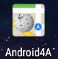
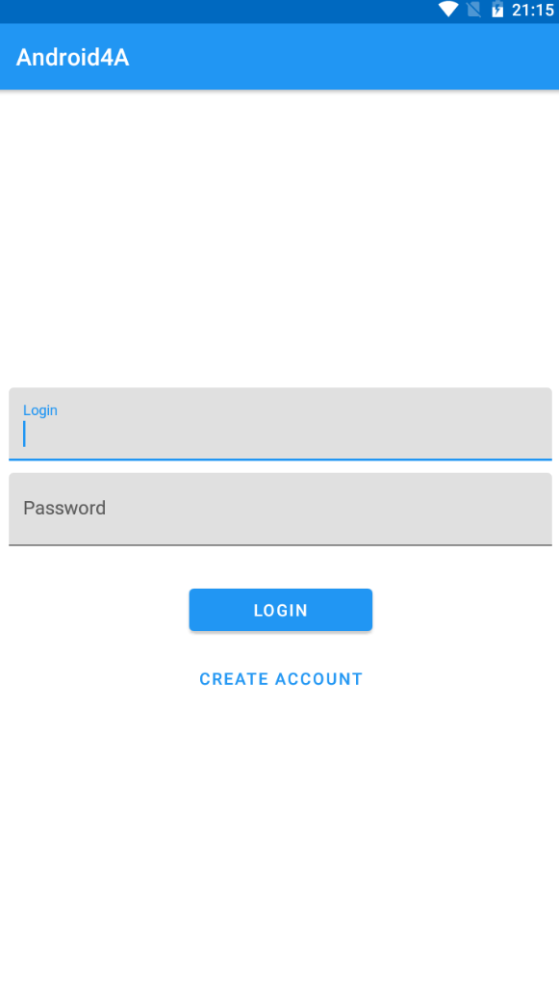
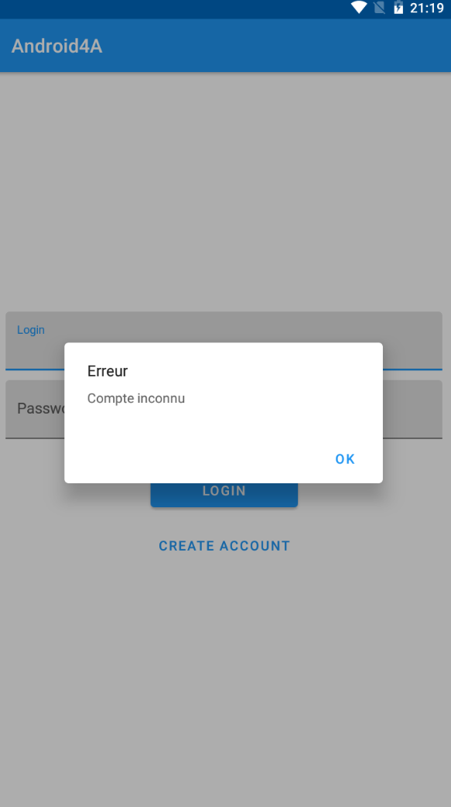
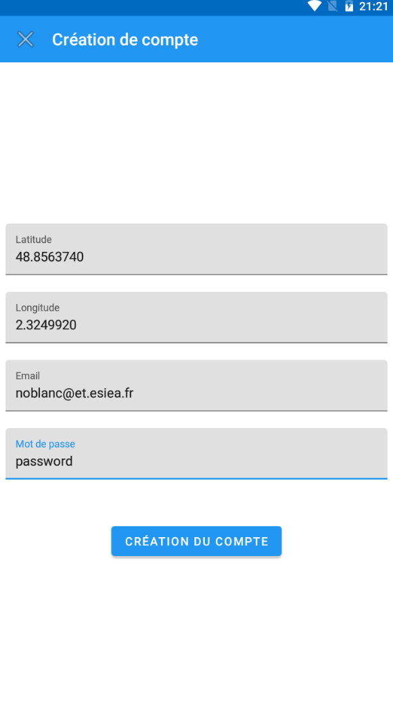
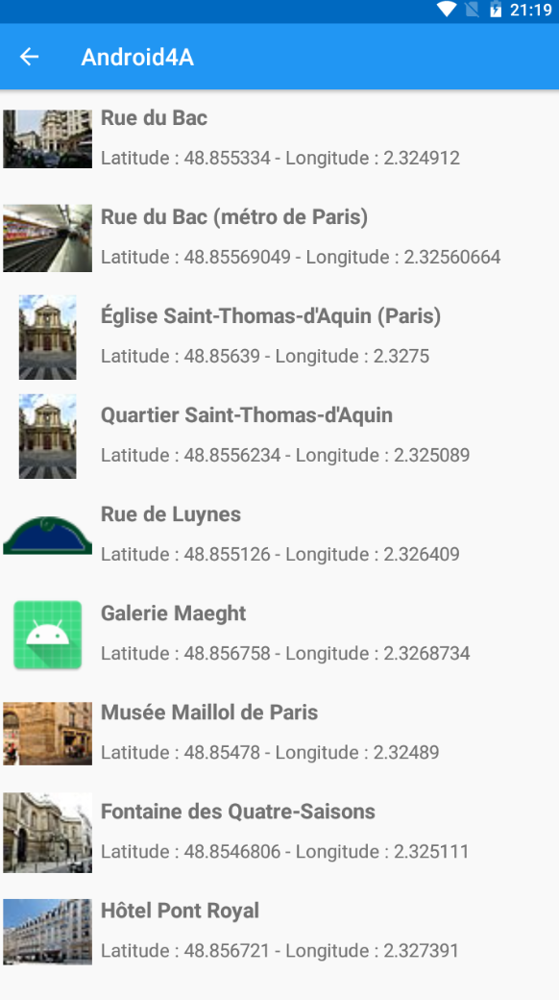

# Streetipedia

## Présentation :

Cette **application Android** a pour vocation de trouver des **informations** sur les **noms de rue** proche d'une position via [l'API Wikipédia](https://www.mediawiki.org/wiki/API:Main_page).

Elle a été développée avec l'utilisation du [pattern MVVM](https://fr.wikipedia.org/wiki/Mod%C3%A8le-vue-vue_mod%C3%A8le) et en respectant le [modèle Clean Architecture](https://blog.adimeo.com/forum-php-2019-clean-architecture) sur Android Studio.

## Idée :

**L'idée** de cette petite application est de pouvoir **à tout moment** sortir son téléphone et pouvoir **se renseigner** (Qui ? Quoi ? Où ?) sur **le nom de la rue** où **l'on se situe** ou une que **l'on vient de croiser**.

## Prérequis :

- Installation **d'Android Studio**
- **Se renseigner** sur l' **API** utilisé ([Wikipédia](https://www.mediawiki.org/wiki/API:Main_page))

## Notation :
### Minimale :
- **Ecran** avec une **liste d'éléments**
- **Ecran** de **connexion**
- Appel **WebService** à une **API Rest**
- **Stokage** de données avec **une BDD**
- Utilisation de Kotlin 

### Les plus :
- **Architecture** :
	- Design Patterns
	- **MVVM**
	- Principe SOLID
- Design

### Autres fonctionnalités :
- Récupération des **données** de **géolocalisation** dans la création de compte
- **Appels WebService** avec **une API Wikipédia**
- Création d'un **compte de base** au téléchargement de l'application avec le login : Login : **test@test.com** et le Password : **test**
- Gestion de **tâche asynchrone**
- **Affichage d'images** via la librarie **[Picasso](https://square.github.io/picasso/)**
- **Création** d'une **icône personalisé** via **Gimp**

## Fonctionnalités :

### Ecran de connexion

C'est ici que **l'utilisateur** va arriver au **lancement** de l'application

Il y a **2 champs** qui permettent de se **loguer** si l'on à déjà un compte (ou avec le **compte par défault** ( login : **test@test.com** password : **test** )

Ou l'utilisateur peut **créer un compte** en appuyant sur le bouton **Create account**

Lors de la **connexion**, si le compte n'a **pas** encore été **créé** ou que le **mot de passe n'est pas bon**, un **pop up apparait** pour le signifier

### Ecran de création de compte

Quand l'utilisateur appuye sur le bouton create account, il **arrive ici**

Il peut ainsi **créer un compte** en **remplissant les 4 champs** demandés

Les champs **latitude** et **longitude** permettent de repéré **où ce trouve l'utilisateur** et ainsi **affiché des résultats proche** de lui

### Ecran d'affichage de la liste

**Affichage** de la **liste des pages** retourné par l'API Wikipédia

Pour l'affichage, une **recyclerView** à été utilisé ainsi qu'un **row_layout** créé pour l'occasion

**Les images** sont récupéré comme les autres données, via **l'API Wikipédia**, et sont affiché grace à **la librairie Picasso**

